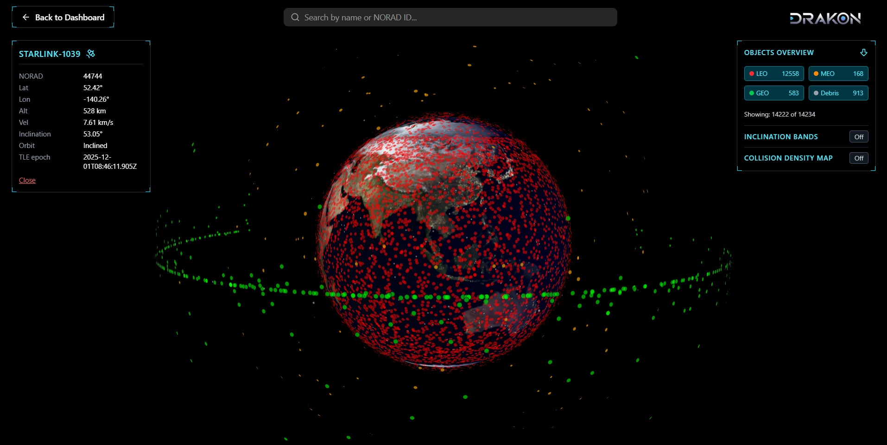

# DRAKON — Space Object Tracking & Collision Awareness Platform

### High-Level Product Showcase (Source Code Private)

DRAKON is a space situational awareness (SSA) interface designed to help operators visualize orbital environments,
monitor space objects, and understand potential collision risks with clarity and confidence.

> ⚠️ This repository contains a **public overview only**.  
> The full implementation, algorithms, and architecture remain private due to ongoing development and research sensitivity.  
> Recruiters and collaborators may request read-only access.

---

## 🌍 Overview

DRAKON transforms live TLE data into an interactive orbital visualization environment.  
It is built to assist with:

- **Monitoring satellites & debris in real time**
- **Understanding orbital congestion and proximity patterns**
- **Exploring orbital planes, density layers, and object metadata**
- **Experimenting with early collision-risk visualization concepts**

The goal is to make complex space operations data **intuitive, visual, and actionable** — bridging engineering depth with human-centered product design.

---

## 🔑 Core Capabilities (High-Level)

### **1. Global Orbital Visualization**

15,000+ satellites and debris objects rendered on a 3D globe with smooth interaction and filtering.

### **2. TLE-Based Orbit Propagation**

Real-time object paths generated using publicly available two-line-element datasets.

### **3. Orbital Plane Mapping**

View orbital planes (LEO/MEO/GEO/Custom) and understand traffic distribution.

### **4. Collision Density Layer**

A heatmap-like layer revealing zones of heavy orbital traffic and potential hotspots.

### **5. Object Search & Metadata**

Instant search + contextual information for satellites and tracked objects.

---

## 📸 Screenshots / Demo

    
    
    
    <video width="45%" controls>
      <source src="Videos/DRAKON_Demo.mp4" type="video/mp4" autoplay loop>
      Your browser does not support the video tag.
    </video>

---

## 🎨 Product Philosophy

DRAKON is designed with a strong emphasis on:

- **Clarity over complexity**
- **Operational awareness in seconds, not minutes**
- **Minimal visual noise, maximum informational depth**
- **Scalable patterns suitable for mission-critical workflows**

---

## 🔒 Why the Code is Private

The underlying implementation includes:

- custom rendering logic
- TLE ingestion optimization
- data-decoupled visualization engine
- early collision-screening experiments
- internal research work

To prevent misuse and protect the integrity of the project, the source code is private.

**However, I’m happy to provide code access to hiring managers, founders, or collaborators.**

📩 Request access → _email or LinkedIn DM_

---

## 📄 Full Case Study

More detailed thinking, UX flows, and design breakdowns:  
👉 **https://www.piyushverma.dev/drakon**

---

## 📬 Access Request / Contact

If you're evaluating my work for a role or collaboration, you can request repo access here:

- Email: **piyush626480@gmail.com**
- LinkedIn: **linkedin.com/in/piyush-verma-dev**

---

## 🔧 Current State of the Project

- Core visualization engine — ✔
- Satellite rendering + filtering — ✔
- Orbital planes — ✔
- Collision density mapping — ✔
- UX prototypes — ✔
- Collision screening engine — 🚧 (in progress)
- Maneuver insights module — planned

DRAKON is actively evolving based on research and community feedback.

---

## ⚙️ Tech Summary (High-Level Only)

- 3D visualization (WebGL-based)
- TLE parsing + propagation
- Modular, data-driven rendering
- Real-time update loops

---

## 🤝 Purpose

DRAKON is built with one intention:  
**make space operations more understandable, visual, and safe.**

It is not just a project — it is an exploration into the future of orbital awareness tools.
